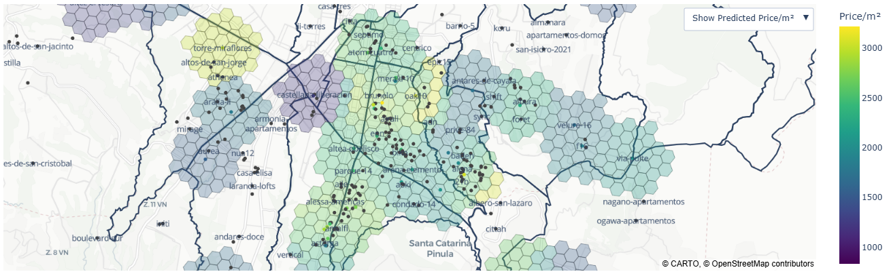

  

 

# Analysis of Guatemala City's Apartment Prices
This project aims to extract, process, analyze, predict and visualize data from apartment locations, prices and footage across Guatemala City. 
An interactive map showing these results is available [here](https://oscar-sandbox.github.io/guatemala-apartments/maps/projects_map_hex.html). 

## The Data

Data was web scraped from the site [Citymap](https://citymap.com.gt/). The dataset contains info on 344 apartment projects and over 1800 apartment types
in Guatemala City, which were published from 2020 to 2025. Apartment info includes selling price, rent, footage, geolocation and publication date, as well other details 
like number of beds and bathrooms. 

Geolocation is available for all entries and footage is shown for almost all entries, while price was published for only 55 of the 344 total projects. 
Prices shown are often launch prices, and may be much lower than current market prices, specially for sold out projects. 
The extraction, processing and exploratory data analysis of this dataset is displayed in the [scripts](https://github.com/Oscar-sandbox/guatemala-apartments/scripts) folder.  

## Interactive Map
An interactive map showing the apartment projects in Guatemala City is available [here](https://oscar-sandbox.github.io/guatemala-apartments/maps/projects_map_hex.html). 
Projects are colored based on the median price per meter squared among the apartment types of a given project.  
When hovering over any of these, additional information is shown, like location and publication date. 
A detailed table with the prices and meters squared of each apartment in the project is also displayed. 

Finally, the map offers estimation of price per meter squared for regions in the surrounding areas of these projects. This was done with a radial nearest neighbors regressor, 
weighted by distance. A radius of 1km was used, which may be over-optimistic. For further work, it is recommended a smaller radius with a denser dataset. 

  

